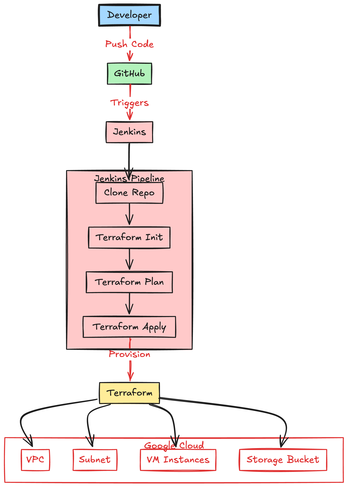

# terraform_jenkins

<h> 🌍 Terraform + Jenkins: Automated GCP Infrastructure Deployment </h>

This repository automates the provisioning of Google Cloud Platform (GCP) resources using Terraform, integrated with Jenkins for continuous deployment (CI/CD).
It’s designed to demonstrate infrastructure as code (IaC) practices — enabling consistent, repeatable, and secure infrastructure deployment.

<h1> 📦 Project Overview </h1>

The pipeline automates:

Cloning the Terraform code from GitHub

Initializing the Terraform backend (terraform init)

Generating a plan of infrastructure changes (terraform plan)

Automatically applying approved changes (terraform apply)

All of this is managed through Jenkins, authenticating to GCP via a service account stored securely in Jenkins credentials.

###🧩 Repository Structure

File	Description
main.tf -	Core Terraform configuration for GCP resources (e.g., VPC, subnet, compute, etc.)
provider.tf	- Defines the GCP provider configuration and authentication details
backend.tf -	Configures remote state storage (e.g., GCS bucket for Terraform state)
variables.tf - Contains input variables for reusable and parameterized deployments
Jenkinsfile -	CI/CD pipeline definition that automates Terraform workflow
README.md	Documentation for setup, usage, and project details

### ⚙️ Prerequisites

####Make sure you have the following tools installed and configured:

Terraform ≥ 1.3.x

Google Cloud SDK (gcloud)

Jenkins with Pipeline Plugin

A GCP service account with roles for:

roles/storage.admin

roles/compute.admin

roles/iam.serviceAccountUser

Jenkins credential named gcp-service-account (of type Secret file)

###🚀 CI/CD Pipeline Flow

The Jenkins pipeline (Jenkinsfile) runs the following stages:

1. Clone Repository

Pulls the latest Terraform configuration from the main branch.

2. Terraform Init

Initializes Terraform and downloads providers.

sh 'terraform init'

3. Terraform Plan

Previews infrastructure changes before applying.

sh 'terraform plan'

4. Terraform Apply

Deploys or updates the infrastructure automatically.

sh 'terraform apply -auto-approve'

5. Post Actions

Cleans up workspace and reports success or failure to the Jenkins dashboard.

###🔒 Security & Credentials

Service Account Key: Stored in Jenkins credentials as gcp-service-account.

Sensitive Variables: Should not be hardcoded; use Jenkins credentials or environment variables instead.

Terraform State: Stored remotely in GCS via backend.tf for team consistency and locking.

###🧠 Example Jenkins Setup

Create a new Pipeline job in Jenkins.

Link it to your repository:

https://github.com/PrashanthDev31/Terraform_jenkins

Add a Jenkins credential named gcp-service-account (type: Secret file) containing your GCP service account JSON key.

Run the pipeline — Jenkins will handle the rest!

###🧰 Future Enhancements

Add linting and validation stages (terraform fmt, terraform validate)

Integrate Slack or email notifications for build results

Use Terraform workspaces for multiple environments (dev/stage/prod)

Enable automated rollbacks on failure

###🪪 License

This project is licensed under the MIT License — you are free to use and modify it for your own infrastructure needs.
